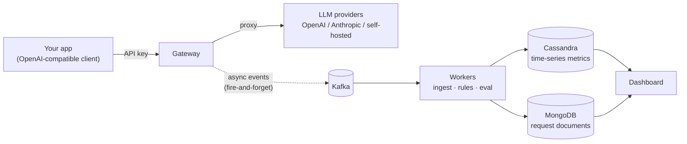

# LLM Tollbooth

A self-hosted gateway that sits between your apps and any LLM provider. It records the cost,
tokens, latency and quality of every call, enforces budgets / rate limits / caching, and runs
user-defined workflows (condition → email / webhook / block).

Every call passes through the tollbooth: it gets metered, and if you're over budget, it gets stopped.

**Status:** early development — Phases 1–3 done (pipeline, observability console, gateway); building Phase 4 (workflows & alerts). See [Roadmap](#roadmap).

---

## The problem

When you run several LLMs (commercial APIs + self-hosted) you can't easily see **where cost leaks**,
**when latency spikes**, or **when quality drops**. LLM Tollbooth makes an app-and-provider-agnostic
control point that answers those questions in real time — and lets you act on them automatically.

You point your app at the gateway instead of the provider (it speaks the **OpenAI-compatible API**,
so only the base URL and key change), and everything else is observed and controlled from one console.

## How it works



The gateway is on the request's **hot path**, so all recording is **asynchronous**: it publishes an
event to Kafka and moves on. If the pipeline is slow or down, the user's response is never blocked.
Workers consume that stream to store metrics (Cassandra) and full request/response documents (MongoDB),
to evaluate rules, and to score quality — all off the critical path.

## Tech stack

| Component  | Role                                                        | Tech                          |
|------------|-------------------------------------------------------------|-------------------------------|
| gateway    | OpenAI-compatible proxy; auth, budget, cache, rate limit    | Node.js · Fastify · TypeScript |
| workers    | ingest / rules / eval consumers                             | Python 3.12 · Kafka           |
| dashboard  | console UI + read API; NextAuth in multi mode               | Next.js (App Router) · TS     |
| loadgen    | synthetic traffic / event generator                        | Python CLI                    |
| infra      | orchestration                                              | Docker Compose                |
| pipeline   | events · metrics · documents                                | Kafka (KRaft) · Cassandra · MongoDB |

A built-in **mock provider** lets the whole system run and demo **without any real API key**.

## Roadmap

Each phase ends in a *running* state — not a half-built one.

- [x] **P1 — Skeleton.** `docker compose up` brings up Kafka/Cassandra/MongoDB/Mailpit; loadgen publishes fake events; a minimal ingest worker consumes and logs them.
- [x] **P2 — Observability.** Ingest worker persists to Cassandra (raw rows + hourly rollups) + MongoDB (request docs); Next.js console with Overview + Requests views.
- [x] **P3 — Gateway.** Fastify proxy: API-key auth, mock + OpenAI/Anthropic/self-hosted adapters, cost calc, caching, budgets, rate limits, Kafka publish; API Keys + Pricing console screens.
- [x] **P4 — Workflows & alerts.** Rules worker (a second consumer group on the same event stream) + rule builder UI + email/webhook/block/tag actions + cooldowns + firing history; latency percentiles and a budget-burn gauge.
- [x] **P5 — Quality, streaming, fallback.** SSE streaming (usage summed from the frames), model fallback when a provider fails, an eval worker that samples calls and has an LLM score them, Quality + Settings screens, and a `quality_drop` rule condition.
- [x] **P6 — Multi-tenancy.** `AUTH_MODE=multi`: sign-up/login (NextAuth + scrypt), projects as the isolation boundary (every console read, and both workers, scoped to the session's tenant), members and owner/member roles, a project switcher, and a weekly per-project usage report email.

## Repository layout

```
llm-tollbooth/
├── docs/          # spec, architecture notes, ADRs, benchmarks
├── gateway/       # Fastify + TypeScript proxy
├── workers/       # Python: ingest / rules / eval
├── dashboard/     # Next.js console
├── loadgen/       # Python load generator
└── infra/         # Docker Compose, Cassandra schema, Mongo seed
```

> Directories appear as each phase builds them — this repo grows one working phase at a time.

## Getting started

Requires Docker (Desktop or Engine) with Compose v2. No local Node/Python needed —
everything runs in containers.

```bash
git clone https://github.com/hojoongdev/LLM-Tollbooth.git
cd LLM-Tollbooth
cp .env.example .env

# Bring up the stack (Kafka, Cassandra, MongoDB, Mailpit, gateway, the three workers, console)
docker compose up -d --wait
```

### Make a call through the tollbooth

The gateway always wants an API key. With `AUTH_MODE=none` there is no console login to
issue one from, so it mints one at boot and prints it:

```bash
KEY=$(docker compose logs gateway | grep -o 'tb_[a-f0-9]\{48\}' | tail -1)

curl http://localhost:8080/v1/chat/completions \
  -H "Authorization: Bearer $KEY" \
  -H "Content-Type: application/json" \
  -H "X-Tollbooth-Tag: checkout-bot" \
  -d '{"model": "gpt-4o", "messages": [{"role": "user", "content": "Hello!"}]}'
```

That is the OpenAI chat-completions API, so **any OpenAI client works** — point its base URL
at `http://localhost:8080/v1` and give it the key. With no provider key configured, the call
is served by the built-in **mock provider**: a real response, real token counts, a real price
off the pricing table, and nothing spent. Add `OPENAI_API_KEY` or `ANTHROPIC_API_KEY` to
`.env` and the same call goes to the real thing — no other change.

### Watch it in the console

```bash
# Push some synthetic traffic through the pipeline as well
docker compose run --rm loadgen --rps 50 --duration 10
```

Open the **console at http://localhost:3000**:

| Screen | What it does |
|---|---|
| **Overview** | Cost / requests / error rate / latency **p50-p95-p99**, a trend chart, a per-model breakdown, and how close each key is to its budget |
| **Requests** | A filterable log — click any row for the prompt, the response, what the call cost, and how a judge scored it |
| **Quality** | The judge's scores over time, model against model, and the calls that scored worst — worst first |
| **API Keys** | Issue keys (shown once), block or revoke them, set per-key budgets and rate limits |
| **Pricing** | The per-model rates every call is billed against — and the provider each one routes to |
| **Rules** | Alert rules, and what they actually did about it |
| **Project** | *(multi mode)* Members and their roles, adding and removing them, and creating another project |
| **Settings** | The sampling rate and the judge model (editable, live) — and what the environment is doing about auth, mail and fallback |

Set a $0.01 daily budget on a key in **API Keys**, spend it, and the next call comes back
`429 insufficient_quota` — recorded in the console as a blocked request.

```bash
# Optional: watch the ingest worker persist events as it flushes batches
docker compose logs -f ingest
```

### Set an alert, and get one

A rule is a **condition**, a **scope**, some **actions** and a **cooldown**. There are four
conditions, and they are not the same shape:

| Condition | Asks | Answered by |
|---|---|---|
| **Metric over a threshold** | cost / tokens / latency p95 / error rate / requests, over a 1h or 24h window | the hourly rollup, on a timer |
| **Budget % reached** | has this key reached 80% of its daily or monthly cap? | the same rollup, but over a *calendar* period — because that is what a budget is, and what the gateway enforces |
| **Keyword in a call** | did the word "password" turn up in a prompt or an answer? | the request document itself — this one no rollup can answer, so it is the only condition evaluated per event |
| **Quality below a score** | has the average judge score fallen under 4.0? | the rollup again — but the *eval worker* writes those counters, seconds after the call, so this is the one condition that is checked even when no traffic arrived |

Open **Rules** and build one — say *cost over **$1.00** in the last **1h**, on **all
traffic**, then **email** me* — then spend past it:

```bash
docker compose run --rm loadgen --rps 45 --duration 12
```

Within a pass (20s by default) the mail is waiting at **http://localhost:8025**:

```
[tollbooth] Hourly spend over $1.00

  scope      all
  metric     cost
  window     last 1h
  threshold  1
  observed   1.57288
  fired at   2026-07-13T15:29:04+00:00

Silenced for the next 1800s.
```

Keep spending and no second mail arrives — that is the cooldown, and it is enforced by the
database rather than by a timer in the worker, so two workers racing on the same tripped
rule send one mail between them.

The other three actions: **webhook** (one payload that Slack, Discord and a plain endpoint
all read), **tag** (labels the requests that made up the breach, so the Requests screen can
filter to exactly them), and **block** (flips the key off — and the gateway stops serving it
on the very next call, not whenever its key cache happens to expire).

A **keyword** rule is the one that reads the call itself. Watch for `swordfish` in the
prompt, then leak it:

```bash
curl http://localhost:8080/v1/chat/completions \
  -H "Authorization: Bearer $KEY" -H "Content-Type: application/json" \
  -d '{"model":"gpt-4o","messages":[{"role":"user","content":"the old key was SWORDFISH"}]}'
```

The alert names the request, and a **tag** action on a keyword rule labels *that one call* —
not the hour around it, which would bury the very thing you need to read. (It matches
case-insensitively, and it only sees traffic that actually went through the gateway:
synthetic loadgen events have no body to search.)

> The rules worker reads the **same `llm.events` topic as the ingest worker, from its own
> consumer group.** It reads the stream to learn which scopes saw traffic, then asks the
> hourly rollup whether any rule scoped to them has crossed a line — because a rule's
> `scope` (`all` / `model:gpt-4o` / `key:abc`) *is* the rollup's breakdown axis, verbatim.
> So "has this key spent more than $5 this hour" is one partition read, not an aggregation.

### Stream it

Add `"stream": true` and the answer arrives frame by frame, in OpenAI's `chat.completion.chunk`
shape — so any OpenAI SDK streams from the tollbooth exactly as it streams from OpenAI:

```bash
curl -N http://localhost:8080/v1/chat/completions \
  -H "Authorization: Bearer $KEY" -H "Content-Type: application/json" \
  -d '{"model":"gpt-4o","messages":[{"role":"user","content":"Explain a tollbooth"}],"stream":true}'
```

A streamed call is **billed exactly like a buffered one**. Usage is summed as the frames pass —
from the provider's own usage frame where it sends one (OpenAI's `include_usage`, Anthropic's
`message_delta`), and counted from the streamed text where it doesn't — so the same call costs
the same money whether or not the client asked for a stream. The reassembled answer is stored
like any other, so the Requests screen reads a streamed call back identically.

The gateway withholds its headers until the first frame, which is what lets a provider that
fails *before it speaks* still become a real HTTP error the client can read — and lets a
failed stream fall back to another model, since nothing has reached the wire yet.

### Fall back when a provider is having a bad day

```bash
# .env
GATEWAY_FALLBACK_MODEL=gpt-4o-mini
```

When a call's provider errors or times out, it is retried on the backup model rather than
handed back as a failure. Because **the pricing table is the routing table**, the backup can
be a different provider entirely — `gpt-4o` falling back to `claude-haiku` is one line. A key
can name its own backup, which wins over the global one.

What is *not* retried is a malformed request: a different model will not fix the caller's bug.
Everything a backup might actually survive is — a timeout, a 5xx, a rate limit, a model the
provider does not have.

The event records **who actually served the call**, so cost and tokens land under the model
that ran, not the one that was asked for — and the request detail says `fell back from gpt-4o`
rather than quietly showing a model nobody requested.

### Score the answers

An **eval worker** samples calls and asks an LLM to score each one 1–5 on relevance,
hallucination risk and tone, with a one-line reason. The score is embedded on the request and
added to the same hourly rollup everything else lives in.

The judge is **the gateway itself** — the worker calls `/v1/chat/completions` like any other
client, with its own key. So evaluation works with **no external API key at all** (the mock
answers), and pointing `EVAL_MODEL` at a real low-cost model is one line of `.env`. It also
means the system dogfoods its own product: judge calls are metered, priced and rate-limited
like everyone else's — and are tagged so the sampler never scores them, because a judge call
is traffic, traffic gets sampled, and a sample is a judge call.

Whole-corpus evaluation costs one judge call per request, so it **samples** — 10% by default,
changeable on the **Settings** screen, which takes effect in seconds without a restart. Open
**Quality** to see the trend, the per-model comparison, and the worst-scoring calls (each one
clicks through to the prompt and the answer the score is a claim about).

One idea runs through all of it: **an unscored call is an absence, not a zero.** The average
divides by what was scored, never by what was served. An unjudged window shows `—`, not `0.00`.
The trend line has *gaps* where nothing was judged, rather than a line dropping to the floor.
And a `quality_drop` rule refuses to fire on a window with no scores, or with fewer than it
was told to trust:

> **quality below 4.0**, over **≥5 scored calls**, in the last **24h**, on **all traffic** → **email me**

```
[tollbooth] Quality drop (all traffic)

  average quality 3.63 below 4 across 9 scored calls in the last 24h
```

Without those two guards the rule would fire continuously on any system where evaluation is
switched off — an unscored window averages 0.0, and 0.0 is below every threshold anyone would
set. That is the loudest imaginable way to report "no data".

## Turn on accounts

Everything above runs open by default (`AUTH_MODE=none`) — the zero-config demo. Two other
modes gate the console, and the switch lives in one place:

```bash
AUTH_MODE=single    # one email/password from .env (ADMIN_EMAIL / ADMIN_PASSWORD)
AUTH_MODE=multi     # real accounts, projects and roles
```

In **multi** mode the console has accounts (NextAuth, email + a scrypt-hashed password) and
becomes multi-tenant. A **project is the isolation boundary** — and it isn't new to the data:
every request, key, rule and metric has carried a `project_id` since P2, when the Cassandra
partition key was first designed to lead with it. It was always the constant `"default"`; multi
mode makes it the session's project instead.

The boundary is enforced, not decorative. **Two accounts cannot see each other's data** — not
in a list, and not by opening a request id directly (that's a not-found, scoped in the query,
never found-then-hidden). It runs both ways: an owner adds a teammate by email, and only then
can they see the project. Members and owners differ (owners manage members; the last owner
can't be removed, or the project would be orphaned), and a switcher moves between the projects
you belong to.

The isolation reaches the workers too, not just the console: the rules worker evaluates each
rule against its own tenant's rollup and stamps firings with the project, and the eval worker
writes each quality score back to the project the scored call belongs to. And once a week, each
project's owners get a **usage report** — requests, cost, error rate, quality — emailed through
the same Mailpit the alerts use.

> The refactor that made this safe leaned on the type checker: every per-project read takes a
> `projectId` argument, so dropping the old global constant turned every call site that touches
> tenant data into a compile error until it was scoped. A missed read is a build failure, not a
> silent cross-tenant leak.

## Benchmarks

Measured on an M4 laptop with the whole stack in Docker Compose — one Kafka broker, one
Cassandra node, one ingest worker. Reproduce with `loadgen` (see `--help`).

| | Result |
|---|---|
| **Gateway overhead** | **p50 3 ms**, p95 3 ms (gateway-side); 5 / 7 ms end-to-end. Measured with `MOCK_LATENCY_MS=0` and `MOCK_JITTER_MS=0`, so all that is left in the number is our own auth, budget, cache and publish work. |
| **Cache hit vs miss** | **1 ms and $0** vs **317 ms and $0.007**. Over 446 calls against five distinct prompts, 412 hits cost nothing at all. |
| **Pipeline throughput** | **155k events/s** published to Kafka by a single producer; **~9.1k events/s** persisted by one ingest worker (2 raw Cassandra tables + hourly counters + Mongo). A 1.45M-event backlog drained to zero lag in ~160 s. |
| **Latency histogram: free** | Adding a 10-bucket histogram to every rollup row cost **nothing measurable**: the same worker still persists **~9.0k events/s** (1.33M-event backlog). Each event touches one bucket in memory, and the cumulative `le` counts the columns want are derived once per *flush*, so 500 events still collapse into one counter UPDATE per hour. |
| **Percentiles: free to read** | p50/p95/p99 come out of a row the Overview was already fetching — **no extra query**. The mean it replaced was hiding a lot: over 383 calls, mean 1.77 s against **p95 4.81 s and p99 8.53 s**. |
| **Block enforcement** | **31,000 ms → ~2 ms.** A blocked key used to keep being served until the gateway's 30 s key cache expired. Now the writer says so: one internal POST (2.2 ms), and the very next call is refused. |
| **Streaming: first token** | **319 ms → 143 ms** to the caller's first byte (p50 of 10 runs), for **+28 ms** on the full answer. The gateway forwards frames as they arrive instead of buffering the completion. (The absolute figures come from the mock, which spends 40% of its latency before its first token, as providers do; what the gateway itself adds is the same ~3 ms it adds to any call.) |
| **Evaluation: what it costs** | One extra LLM call per *sampled* request, and nothing else. At the default 10%, 60 calls produced **9 judge calls** and 9 scores. The scores ride on rollup rows the dashboard already reads, so the Quality screen costs **no extra query** — the same partition lookups the Overview does. |
| **Dashboard at 1.5M requests** | Overview **13 ms**, Requests **22 ms**. Every wide read is a rollup partition lookup; nothing scans the raw tables. |

```bash
docker compose run --rm loadgen --rps 0    --duration 10                        # flood the pipeline
docker compose run --rm loadgen --mode gateway --api-key "$KEY" --rps 100       # load the gateway
docker compose run --rm loadgen --mode gateway --api-key "$KEY" --distinct 5    # make the cache hit
```

The full design lives in [`docs/spec.md`](docs/spec.md).

## License

MIT
