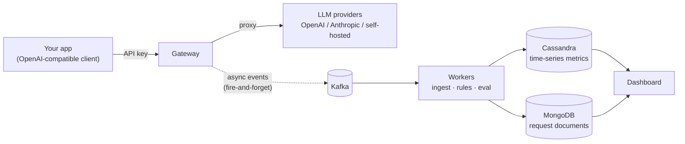

# LLM Tollbooth

A self-hosted gateway that sits between your apps and any LLM provider. It records the cost,
tokens, latency and quality of every call, enforces budgets / rate limits / caching, and runs
user-defined workflows (condition → email / webhook / block).

Every call passes through the tollbooth: it gets metered, and if you're over budget, it gets stopped.

**Status:** early development — building Phase 1 (infrastructure skeleton). See [Roadmap](#roadmap).

---

## The problem

When you run several LLMs (commercial APIs + self-hosted) you can't easily see **where cost leaks**,
**when latency spikes**, or **when quality drops**. LLM Tollbooth makes an app-and-provider-agnostic
control point that answers those questions in real time — and lets you act on them automatically.

You point your app at the gateway instead of the provider (it speaks the **OpenAI-compatible API**,
so only the base URL and key change), and everything else is observed and controlled from one console.

## How it works



The gateway is on the request's **hot path**, so all recording is **asynchronous**: it publishes an
event to Kafka and moves on. If the pipeline is slow or down, the user's response is never blocked.
Workers consume that stream to store metrics (Cassandra) and full request/response documents (MongoDB),
to evaluate rules, and to score quality — all off the critical path.

## Tech stack

| Component  | Role                                                        | Tech                          |
|------------|-------------------------------------------------------------|-------------------------------|
| gateway    | OpenAI-compatible proxy; auth, budget, cache, rate limit    | Node.js · Fastify · TypeScript |
| workers    | ingest / rules / eval consumers                             | Python 3.12 · Kafka           |
| dashboard  | console UI + read API                                       | Next.js (App Router) · TS     |
| loadgen    | synthetic traffic / event generator                        | Python CLI                    |
| infra      | orchestration                                              | Docker Compose                |
| pipeline   | events · metrics · documents                                | Kafka (KRaft) · Cassandra · MongoDB |

A built-in **mock provider** lets the whole system run and demo **without any real API key**.

## Roadmap

Each phase ends in a *running* state — not a half-built one.

- [ ] **P1 — Skeleton.** `docker compose up` brings up Kafka/Cassandra/MongoDB/MailHog; loadgen publishes fake events; a minimal ingest worker consumes and logs them.
- [ ] **P2 — Observability.** Workers persist to Cassandra (metrics) + MongoDB (requests); dashboard Overview + Requests views.
- [ ] **P3 — Gateway.** Fastify proxy: API-key auth, mock + OpenAI/Anthropic adapters, cost calc, caching, budgets, rate limits, Kafka publish.
- [ ] **P4 — Workflows & alerts.** Rules worker + rule builder UI + email/webhook/block/tag actions + cooldowns + firing history.
- [ ] **P5 — Quality, streaming, fallback.** Sampled LLM-as-judge evaluation, quality dashboard, SSE proxy, model fallback.
- [ ] **P6 — Multi-tenancy.** Sign-up/login, project isolation, roles, weekly usage report emails.

## Repository layout

```
llm-tollbooth/
├── docs/          # spec, architecture notes, ADRs, benchmarks
├── gateway/       # Fastify + TypeScript proxy
├── workers/       # Python: ingest / rules / eval
├── dashboard/     # Next.js console
├── loadgen/       # Python load generator
└── infra/         # Docker Compose, Cassandra schema, Mongo seed
```

> Directories appear as each phase builds them — this repo grows one working phase at a time.

## Getting started

Coming with **P1** (`docker compose up`). Until then, see the full design in [`docs/spec.md`](docs/spec.md).

## License

MIT
